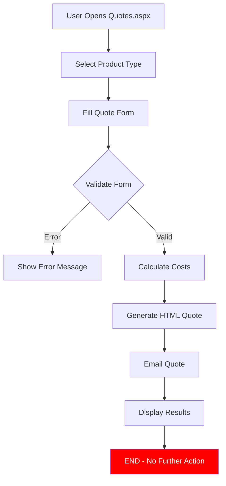
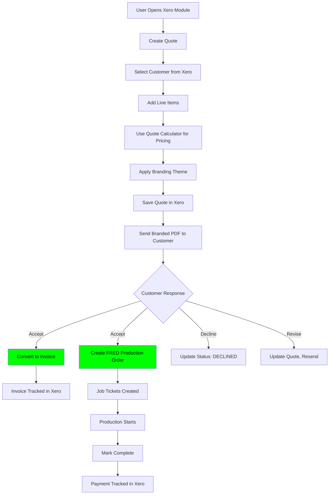

# 🔷 Legacy VB.NET Quotes System - Complete Workflow Analysis

**Generated:** January 3, 2026  
**Source Files:** `C:\Users\gpoli\GIT\In_House_SQL\InHousePrint\Quotes.aspx` & `Quotes.aspx.vb` (6,061 lines)  
**Purpose:** Document how the legacy VB.NET quote system worked and its connection to Xero/FRED

---

## 📋 **CRITICAL DISCOVERY:**

**⚠️ THE LEGACY QUOTE SYSTEM HAD NO AUTOMATION TO XERO OR FRED ⚠️**

The `Quotes.aspx` system was a **standalone quote calculator** that:
1. ✅ Calculated pricing for various print products
2. ✅ Emailed quotes to `quotes@inhouseprint.com.au`
3. ❌ **NEVER created orders in FRED database**
4. ❌ **NEVER created quotes/invoices in Xero**
5. ❌ **NEVER connected quotes to production workflow**

---

## 🏗️ **LEGACY QUOTE SYSTEM ARCHITECTURE**

### **Quote Types Supported:**

```vb
' 5 Major Quote Categories:
1. Flyer Quotes (menuBtnFlyers_Click)
2. Letterhead Quotes (menuBtnLetterHeads_Click)
3. Booklet Quotes (Saddle Stitch)
4. Perfect Bound Books (PBB)
5. Wideformat/Ridged Materials (Corflute, Signs, Banners)
```

### **Quote Calculation Process:**



---

## 📄 **EXAMPLE: FLYER QUOTE WORKFLOW**

### **1. User Fills Form:**

```vb
Protected Sub btnFlyerSubmitQuote_Click(sender As Object, e As DirectEventArgs)
    ' User selects:
    ' - Print quantities (3 quantities supported)
    ' - Finish size (A5, A4, DL, Custom)
    ' - Stock type and GSM
    ' - Print sides (4/0, 4/4, 1/0, etc.)
    ' - Cello lamination (optional)
    ' - Folding (optional)
    ' - Discount percentage
    
    ' Validate form
    If ErrorCheckFlyerQuoteForm() = True Then
        Exit Sub
    End If
    
    ' Create 3 FlyerQuote objects (one per quantity)
    Dim firstQuote As FlyerQuote = fillFlyerQuoteDetails(qty1, discount1)
    Dim secondQuote As FlyerQuote = fillFlyerQuoteDetails(qty2, discount2)
    Dim thirdQuote As FlyerQuote = fillFlyerQuoteDetails(qty3, discount3)
    
    ' Calculate totals
    lblFlyerQuoteTotals1.Html = firstQuote.CalculateNewQuote()
    lblFlyerQuoteTotals2.Html = secondQuote.CalculateNewQuote()
    lblFlyerQuoteTotals3.Html = thirdQuote.CalculateNewQuote()
    
    ' Generate HTML for email
    Dim htmlFullSpecs As String = SetupFlyerHTMLFullSpecs(firstQuote, secondQuote, thirdQuote)
    Dim htmlShortSpecs As String = SetupFlyerShortSpecsHtml(firstQuote)
    
    ' EMAIL THE QUOTE (ONLY ACTION TAKEN!)
    Dim UserDetails As String = "New Flyer quote completed by " + CurrentUserName
    Dim emailSender = New SendEmail
    emailSender.SendNewEmail(
        "quotes@inhouseprint.com.au",
        "printing@inhouseprint.com.au,bob@inhouseprint.com.au,nevada@inhouseprint.com.au",
        "New Flyer Quote",
        UserDetails + "<br/><br/>" + htmlShortSpecs + "<br/><br/>" + htmlFullSpecs
    )
    
    ' Display results on screen
    pnlflyerquotehtmlTotals.Show()
    
    ' ❌ NO ORDER CREATED
    ' ❌ NO XERO INTEGRATION
    ' ❌ NO DATABASE RECORD SAVED
End Sub
```

---

## 💰 **QUOTE CALCULATION BREAKDOWN**

### **FlyerQuote Class Cost Structure:**

```vb
' Flyer Quote Components:
Public Class FlyerQuote
    ' Material Costs
    Public Property CostOfSheetsRequired As Decimal     ' Paper cost
    
    ' Print Costs
    Public Property totalClickCost As Decimal           ' Digital click charges
    Public Property ImpositionSetupCost As Decimal      ' Artwork setup
    
    ' Finishing Costs
    Public Property GuilloSetup As Decimal              ' Guillotine setup
    Public Property CuttingCharge As Decimal            ' Cutting labor
    Public Property celloSetupCost As Decimal           ' Lamination setup
    Public Property CelloLaborCharge As Decimal         ' Lamination labor
    Public Property celloMaterialCost As Decimal        ' Lamination film
    Public Property folderSetupCharge As Decimal        ' Folder setup
    Public Property FoldingRunningLaborCharge As Decimal ' Folding labor
    
    ' Business Costs
    Public Property totalCostToBusiness As Decimal      ' Sum of all costs above
    Public Property profitMargin As Decimal             ' Margin % (from database)
    Public Property Discount As Decimal                 ' Customer discount %
    Public Property DiscountAmount As Decimal           ' $ discount
    Public Property totalCostExGST As Decimal           ' After margin, before tax
    Public Property GST As Decimal                      ' 10%
    Public Property totalCostIncGST As Decimal          ' Final price
End Class
```

### **Quote HTML Output Example:**

```html
<!-- Email Body Sent to quotes@inhouseprint.com.au -->
<span>New Flyer quote has been completed by John Smith</span><br/>

<!-- SHORT SPECS -->
<b>Stock:</b> 350GSM Uncoated<br/>
<b>Finish Size:</b> 210mm x  297mm<br/>
<b>Side 1:</b> 4 Colour<br/>
<b>Side 2:</b> 4 Colour<br/>
<b>Cello Side 1:</b> Gloss<br/>
<b>Cello Side 2:</b> None<br/>

<!-- FULL COST BREAKDOWN TABLE -->
<Table Class='tg'>
<tr><td>QTY</td><td><b>500</b></td><td><b>1000</b></td><td><b>2000</b></td></tr>
<tr><td>Paper Cost</td><td>$45.00</td><td>$85.00</td><td>$165.00</td></tr>
<tr><td>Imposition Setup</td><td>$25.00</td><td>$25.00</td><td>$25.00</td></tr>
<tr><td>Click Cost</td><td>$120.50</td><td>$235.20</td><td>$465.80</td></tr>
<tr><td>Guillo Setup</td><td>$15.00</td><td>$15.00</td><td>$15.00</td></tr>
<tr><td>Cutting Cost</td><td>$8.50</td><td>$14.25</td><td>$26.80</td></tr>
<tr><td>Cello Setup</td><td>$20.00</td><td>$20.00</td><td>$20.00</td></tr>
<tr><td>Cello Labor Cost</td><td>$12.40</td><td>$22.15</td><td>$42.30</td></tr>
<tr><td>Cello Material Cost</td><td>$18.60</td><td>$35.80</td><td>$69.50</td></tr>
<tr><td>Cost to business</td><td>$265.00</td><td>$452.40</td><td>$829.40</td></tr>
<tr><td>Profit Margin</td><td>45%</td><td>40%</td><td>35%</td></tr>
<tr><td>Profit</td><td>$119.25</td><td>$180.96</td><td>$281.29</td></tr>
<tr><td>Discount %:</td><td>0%</td><td>0%</td><td>5%</td></tr>
<tr><td>Total ex GST:</td><td>$384.25</td><td>$633.36</td><td>$1,069.05</td></tr>
<tr><td>GST @ 10%</td><td>$38.43</td><td>$63.34</td><td>$106.91</td></tr>
<tr><td>Total Inc GST:</td><td>$422.68</td><td>$696.70</td><td>$1,175.96</td></tr>
</table>
```

---

## 🔧 **QUOTE SETTINGS DATABASE**

### **Database Tables Used:**

```sql
-- Quote-specific settings tables (InHousePrint database)
Quote_GenericSetting           -- General settings (GST, waste %, labor rates)
Quote_DigitalClicks            -- Click costs per A4 (B&W, Color, etc.)
Quote_DigitalStockType         -- Stock categories (Uncoated, Gloss, Matt)
Quote_DigitalStocks            -- Actual stock specs (width, length, GSM, cost)
Quote_ProfitMargins            -- Profit margins by price range
Quote_PBBPerBookBindCost       -- Perfect binding costs
Quote_PBBExtraBookScale        -- Extra book pricing scales
Quote_RidgedStockType          -- Wideformat materials (Corflute, Foamboard)
Quote_RidgedStocks             -- Wideformat stock details
Quote_RidgedProfitMargin       -- Wideformat profit margins
Quote_RollStockType            -- Roll stock categories
Quote_RollStocks               -- Roll stock details
```

### **Sample Settings:**

```vb
' Generic Settings Example:
FlyerBleedMeasurement = 6  ' 3mm bleed each side
DigitalImpositionSetup = 25
BinderyLaborPerHour = 65
GST = 10
MaterialWastePercentage = 8
GuilloSetup = 15
CuttingBlockSheets = 100
CostPerBlock = 3.50
FoldingSetupCost = 20
FoldingCostPer1000 = 12
CelloSetupCost = 20
CelloCostPerHour = 65
CelloGlossShortPerM = 0.85
CelloMattWidePerM = 1.10
BookletSetup = 25
BookletCostPerBook = 0.15
PBBBinderSetup = 40
PBBThreeWayCostPerBook = 0.25
HP560InkCost = 4.50  ' Per square meter
HPR2000InkCost = 3.80  ' Per square meter
```

---

## 🚫 **WHY QUOTES NEVER BECAME ORDERS**

### **The Manual Workflow Gap:**

```
┌──────────────────────────────────────────────────────────────┐
│ WHAT HAPPENED IN REALITY:                                    │
├──────────────────────────────────────────────────────────────┤
│                                                               │
│ 1. User creates quote in Quotes.aspx                         │
│    └─> Quote emailed to quotes@inhouseprint.com.au           │
│                                                               │
│ 2. Customer receives quote via email                         │
│    └─> Quote is PDF or HTML email                            │
│                                                               │
│ 3. Customer approves quote (phone/email)                     │
│    └─> Manual communication, no system tracking              │
│                                                               │
│ 4. Staff manually creates NEW ORDER in NewOrder.aspx         │
│    ├─> Selects customer from MYOB dropdown                   │
│    ├─> Manually enters job details                           │
│    ├─> Manually enters pricing                               │
│    └─> Creates job tickets manually                          │
│                                                               │
│ 5. Order saved to FRED database                              │
│    └─> Orders table, JobTickets table                        │
│                                                               │
│ 6. Production completes job                                  │
│    └─> Job tickets marked complete                           │
│                                                               │
│ 7. Staff manually creates invoice in Xero website            │
│    ├─> Opens Xero.com in browser                             │
│    ├─> Selects customer                                      │
│    ├─> Manually enters line items                            │
│    └─> Saves invoice in Xero                                 │
│                                                               │
│ 8. Invoice number SOMETIMES written on order in FRED         │
│    └─> Optional manual step, often skipped                   │
│                                                               │
└──────────────────────────────────────────────────────────────┘
```

### **NO INTEGRATION CODE FOUND:**

```vb
' ❌ NO CODE LIKE THIS EXISTS IN Quotes.aspx.vb:

' This DOES NOT exist:
Protected Sub ConvertQuoteToOrder()
    ' Create order in FRED database
    ' Create job tickets
    ' Link to Xero
End Sub

' This DOES NOT exist:
Protected Sub SendQuoteToXero()
    ' Create quote in Xero
    ' Store quote ID
    ' Link to order
End Sub

' This DOES NOT exist:
Protected Sub SaveQuoteToDatabase()
    ' Save quote details
    ' Store quote number
    ' Allow retrieval later
End Sub
```

---

## 📊 **COMPARISON: LEGACY vs NEW SYSTEM**

| Feature | Legacy VB.NET System | New Xero Module (Proposed) |
|---------|---------------------|----------------------------|
| **Quote Creation** | ✅ Multiple product types | ✅ Flexible line items |
| **Cost Calculation** | ✅ Complex formulas | ✅ Calculator integration |
| **Quote Storage** | ❌ Not saved anywhere | ✅ Stored in Xero |
| **Quote Retrieval** | ❌ Lost after email | ✅ List/search/filter quotes |
| **Quote → Invoice** | ❌ Manual recreation | ✅ One-click conversion |
| **Quote → Order** | ❌ Manual recreation | ✅ Auto-create FRED order |
| **Customer Portal** | ❌ None | ✅ Customer can view/accept |
| **Version Control** | ❌ None | ✅ Xero tracks versions |
| **Integration** | ❌ Standalone | ✅ Xero + FRED connected |
| **Branding** | ❌ Plain HTML | ✅ Branded PDF templates |
| **Tracking** | ❌ Email only | ✅ Status tracking (DRAFT/SENT/ACCEPTED) |

---

## 🔄 **LEGACY QUOTE EMAIL RECIPIENTS:**

```vb
Public Property SendToEmailAddress As String = _
    "printing@inhouseprint.com.au," & _
    "bob@inhouseprint.com.au," & _
    "nevada@inhouseprint.com.au"

' All quotes emailed to this distribution list
' No customer email sent
' No quote tracking
' No follow-up system
```

---

## 🛠️ **PRODUCTS SUPPORTED IN LEGACY SYSTEM:**

### **Digital Print Products:**

```vb
1. Flyers
   - Standard sizes: A5, A4, A3, DL, A6
   - Custom sizes supported
   - Print modes: 4/0, 4/4, 1/0, 1/1, B&W
   - Cello: Gloss/Matt, Single or Double sided
   - Folding: Multiple passes supported

2. Letterheads
   - A4 size only
   - Various stocks and GSMs
   - Print modes supported

3. Booklets (Saddle Stitch)
   - Page counts divisible by 4
   - Self-cover or hard cover
   - Cover cello optional
   - Internal page color sections

4. Perfect Bound Books
   - Custom page counts
   - Hard cover required
   - Complex binding calculations
   - 3-way trimming costs
   - Proof costs included
```

### **Wideformat Products:**

```vb
5. Ridged Materials (Corflute, Foamboard, ACM)
   - Square meter pricing
   - Thickness variations
   - Print machine selection (HP R2000, HP 560)
   - Double-sided printing
   - Multiple artworks costing

6. Roll-to-Roll Materials
   - Banner material
   - Vinyl
   - Fabric
   - Custom roll sizes
```

---

## 📝 **KEY QUOTE CALCULATION CLASSES:**

```vb
' 5 Main Quote Classes (in Classes/ folder):

Class FlyerQuote
    ' Properties for flyer calculations
    ' Methods: CalculateNewQuote(), GetProfitMargin(), etc.
    
Class BookletQuote
    ' Saddle stitch booklet calculations
    ' Cover + internals + binding
    
Class PerfectBBQuote
    ' Perfect bound book calculations
    ' Complex binding, trimming, scoring
    
Class RidgedQuote
    ' Square meter based calculations
    ' Ink cost per square meter
    ' Machine running costs
    
Class RollQuote
    ' Roll material calculations
    ' Linear meter pricing
```

---

## 🎯 **WHAT WE CAN LEARN FOR NEW SYSTEM:**

### **✅ Good Features to Keep:**

1. **Multiple Quantity Pricing** - Show 3 price points
2. **Detailed Cost Breakdown** - Show all cost components
3. **Profit Margin by Price Range** - Higher margins on lower quantities
4. **Discount System** - Apply discounts per quantity
5. **Short + Full Specs** - Brief summary + detailed breakdown
6. **Comprehensive Product Coverage** - Many product types supported

### **❌ Problems to Fix:**

1. **No Quote Persistence** - Quotes disappear after email
2. **No Xero Integration** - Manual invoice creation required
3. **No Order Creation** - Manual order entry in FRED
4. **No Customer Access** - Customer never sees quote in system
5. **No Follow-up Tracking** - No idea if quote was accepted/declined
6. **No Version Control** - Can't update/revise quotes
7. **Email-Only Communication** - Unprofessional, gets lost

---

## 🚀 **PROPOSED NEW WORKFLOW:**



---

## 📁 **LEGACY FILES INVENTORY:**

```
C:\Users\gpoli\GIT\In_House_SQL\InHousePrint\
├── Quotes.aspx (3,619 lines) - Main quote UI
├── Quotes.aspx.vb (6,061 lines) - Quote logic
├── Quotes.aspx.designer.vb - Auto-generated
├── Classes/
│   ├── FlyerQuote.vb
│   ├── BookletQuote.vb
│   ├── PerfectBBQuote.vb
│   ├── RidgedQuote.vb
│   └── RollQuote.vb
└── DAL/
    └── DataAccess.vb - Database queries
```

---

## 🔑 **KEY DATABASE QUERIES IN LEGACY SYSTEM:**

```vb
' Profit Margin Lookup (by price range):
Function GetProfitMarginsForProduct(productID As Integer) As List
    Return InHousePrintContext.Quote_ProfitMargins _
        .Where(Function(f) f.ProductTypeID = productID) _
        .ToList()
End Function

' Stock Details:
Function GetDigitalStocks(stockTypeID As Integer) As List
    Return InHousePrintContext.Quote_DigitalStocks _
        .Where(Function(f) f.StockTypeID = stockTypeID) _
        .ToList()
End Function

' Click Costs:
Function GetDigitalClicks() As List
    Return InHousePrintContext.Quote_DigitalClicks.ToList()
End Function

' Generic Settings:
Function GetSetting(settingName As String) As String
    Return InHousePrintContext.Quote_GenericSetting _
        .Where(Function(f) f.SettingDesc = settingName) _
        .Select(Function(s) s.SettingValue) _
        .FirstOrDefault()
End Function
```

---

## 💡 **RECOMMENDATIONS FOR NEW XERO MODULE:**

### **Phase 1: Basic Quote Creation**
- ✅ Use Xero Quotes API
- ✅ Store quotes in Xero (not just emails)
- ✅ Apply branding themes from Xero
- ✅ Send quotes via Xero email system

### **Phase 2: Quote Calculator Integration**
- ✅ Embed existing quote calculator tools
- ✅ "Calculate Price" button in line items
- ✅ Auto-fill line item with calculated cost
- ✅ Show cost breakdown as line item notes

### **Phase 3: Order Automation**
- ✅ "Accept Quote" → Create Invoice
- ✅ "Accept Quote" → Create FRED Order
- ✅ Auto-generate job tickets from line items
- ✅ Link invoice number back to order

### **Phase 4: Advanced Features**
- ✅ Customer portal access to quotes
- ✅ Quote status tracking dashboard
- ✅ Quote version history
- ✅ Quote templates for repeat customers
- ✅ Automated follow-up reminders

---

## 📞 **CONCLUSION:**

**The legacy VB.NET quote system was a sophisticated calculator but had ZERO integration with:**
- ❌ Xero (quotes or invoices)
- ❌ FRED orders or job tickets
- ❌ Customer database
- ❌ Production workflow

**The new Xero Module will fill this gap by:**
- ✅ Creating persistent quotes in Xero
- ✅ Converting quotes to invoices automatically
- ✅ Creating production orders in FRED
- ✅ Linking entire workflow Quote → Invoice → Order → Production

**This is why you never found Xero integration code - it never existed in the legacy system!**

---

**Next Steps:** Implement the new Xero Quote module with proper integration following the workflow documented in `XERO_QUOTES_COMPREHENSIVE_ANALYSIS.md`
