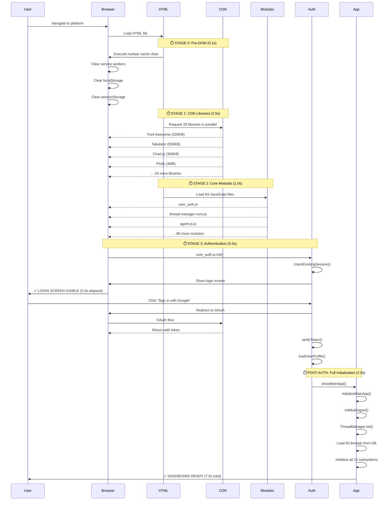
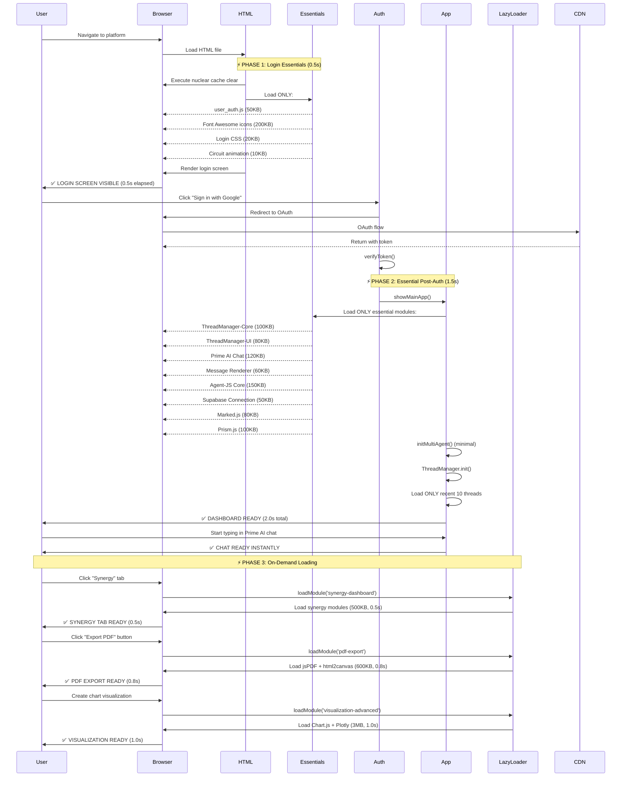

# 🔄 Loading Sequence Diagram - AI Agents Platform

**Visual Guide**: Dependency chain and loading order analysis

---

## 📊 CURRENT SEQUENCE (What Happens Now)



**Total Time to Dashboard**: 7.0 seconds (5s login + 2s post-auth)

---

## 🚀 OPTIMIZED SEQUENCE (What Should Happen)



**Total Time to Dashboard**: 2.0 seconds (0.5s login + 1.5s post-auth)  
**Improvement**: 3.5x faster! (7.0s → 2.0s)

---

## 🔗 DEPENDENCY CHAIN ANALYSIS

### **Critical Path: Login → Chat**
```
┌─────────────────────────────────────────────────────────────┐
│ CRITICAL PATH (Must load sequentially)                     │
├─────────────────────────────────────────────────────────────┤
│ 1. HTML file (browser request)                    0.1s     │
│ 2. Nuclear cache clear (inline script)            0.1s     │
│ 3. user_auth.js (authentication logic)            0.1s     │
│ 4. Font Awesome (OAuth button icons)              0.2s     │
│ 5. Login screen CSS (visual styling)              0.05s    │
│ ─────────────────────────────────────────────────────────── │
│ TOTAL: LOGIN SCREEN VISIBLE                       0.55s    │
│                                                             │
│ 6. OAuth redirect + token verification            1.0s     │
│ 7. ThreadManager-Core (thread list structure)     0.2s     │
│ 8. Prime AI Chat (chat interface)                 0.2s     │
│ 9. Message Renderer (display messages)            0.1s     │
│ 10. Agent-JS Core (multi-agent system)            0.2s     │
│ 11. Supabase (real-time updates)                  0.3s     │
│ 12. Load recent 10 threads (database query)       0.2s     │
│ ─────────────────────────────────────────────────────────── │
│ TOTAL: CHAT READY                                 2.20s    │
└─────────────────────────────────────────────────────────────┘
```

### **Non-Critical Path: Features**
```
┌─────────────────────────────────────────────────────────────┐
│ NON-CRITICAL (Can load on-demand)                          │
├─────────────────────────────────────────────────────────────┤
│ ⏸️ Synergy Dashboard (10 modules)                 0.5s     │
│    └─ Load when user clicks "Synergy" tab                  │
│                                                             │
│ ⏸️ Automation Canvas (3 modules + Dragula)        0.3s     │
│    └─ Load when user clicks "Automations" tab              │
│                                                             │
│ ⏸️ Transcription System (5 modules)               0.4s     │
│    └─ Load when user opens transcription sidebar           │
│                                                             │
│ ⏸️ Spreadsheet Editor (Handsontable 1.8MB)        1.5s     │
│    └─ Load when user opens spreadsheet tool                │
│                                                             │
│ ⏸️ PDF Export (jsPDF + html2canvas 600KB)         0.8s     │
│    └─ Load when user clicks "Export PDF"                   │
│                                                             │
│ ⏸️ Advanced Visualizations (Chart.js + Plotly)    1.0s     │
│    └─ Load when user creates visualization                 │
└─────────────────────────────────────────────────────────────┘
```

---

## 📊 MODULE DEPENDENCY GRAPH

### **Phase 1: Login Screen (Critical)**
```
user_auth.js (CORE)
    ├── API_BASE_URL (inline config)
    ├── Font Awesome (icons)
    ├── Login CSS (styles)
    └── Circuit animation (visual)

Dependencies: NONE (self-contained)
Load Order: Synchronous (blocks until ready)
```

### **Phase 2: Essential Post-Auth (Critical)**
```
ThreadManager-Core
    ├── API_BASE_URL (inline config)
    ├── Supabase Connection (real-time)
    └── Data Loader (caching)

ThreadManager-UI
    ├── ThreadManager-Core (base)
    └── ThreadCard-Templates (rendering)

Prime AI Chat
    ├── Message Renderer (display)
    ├── Marked.js (markdown)
    ├── Prism.js (code highlighting)
    └── Agent-JS Core (multi-agent)

Agent-JS Core
    ├── Agent-Column (rendering)
    ├── Agent-Input-Manager (input)
    └── Error Recovery Manager (resilience)

Dependencies: Linear chain (must load in order)
Load Order: Sequential with await
```

### **Phase 3: Feature Modules (Non-Critical)**
```
Synergy Dashboard
    ├── Synergy-Board-Init
    ├── Synergy-Sidebar-Renderer
    ├── Synergy-Manager
    └── ThreadManager-Synergy (bridge)

Automation Canvas
    ├── Dragula (drag-drop library)
    ├── Automation-Workflows
    └── Automation-Canvas-Extensions

Transcription System
    ├── Transcription-Config
    ├── Transcription-Sidebar
    ├── TTS-Module
    └── Transcription-Streaming

Dependencies: Self-contained (no cross-module deps)
Load Order: Parallel (can load independently)
```

---

## ⚡ OPTIMIZATION: PARALLEL LOADING OPPORTUNITIES

### **Current: Sequential Loading (Slow)**
```
Load Module 1 → Wait → Load Module 2 → Wait → Load Module 3 → Wait
Total Time: 1.0s + 1.0s + 1.0s = 3.0s
```

### **Optimized: Parallel Loading (Fast)**
```
Load Module 1 ┐
Load Module 2 ├─ Wait ─→ All loaded
Load Module 3 ┘
Total Time: 1.0s (3x faster!)
```

### **Implementation: Promise.all()**
```javascript
// CURRENT (Sequential):
await loadModule('synergy-board-init.js');      // 0.2s
await loadModule('synergy-sidebar-renderer.js'); // 0.2s
await loadModule('synergy-manager.js');         // 0.1s
// Total: 0.5s

// OPTIMIZED (Parallel):
await Promise.all([
    loadModule('synergy-board-init.js'),      // ┐
    loadModule('synergy-sidebar-renderer.js'), // ├─ 0.2s total
    loadModule('synergy-manager.js')          // ┘
]);
// Total: 0.2s (2.5x faster!)
```

---

## 🎯 LOADING PRIORITY MATRIX

### **Priority 1: MUST Load Before Login Screen**
```
Module                  Size        Why Critical?
================================================================
user_auth.js            50 KB       Authentication logic
Font Awesome            200 KB      OAuth button icons
Login CSS               20 KB       Visual styling
Circuit animation       10 KB       Login screen background
API_BASE_URL config     0 KB        Environment detection
================================================================
TOTAL:                  280 KB      0.5s on 3G connection
```

### **Priority 2: MUST Load After Login (Immediate)**
```
Module                  Size        Why Critical?
================================================================
ThreadManager-Core      100 KB      Thread list structure
ThreadManager-UI        80 KB       Thread card rendering
Prime AI Chat           120 KB      Main chat interface
Message Renderer        60 KB       Display chat messages
Agent-JS Core           150 KB      Multi-agent system
Supabase Connection     50 KB       Real-time updates
Marked.js               80 KB       Markdown parsing
Prism.js                100 KB      Code syntax highlighting
================================================================
TOTAL:                  740 KB      1.5s on 3G connection
```

### **Priority 3: CAN Load On-Demand (Optional)**
```
Feature                 Size        Load Trigger
================================================================
Synergy Dashboard       500 KB      User clicks "Synergy" tab
Automation Canvas       300 KB      User clicks "Automations" tab
Transcription System    400 KB      User opens transcription sidebar
Spreadsheet Editor      1.8 MB      User opens spreadsheet tool
PDF Export              600 KB      User clicks "Export PDF"
Advanced Visualizations 3.0 MB      User creates chart/graph
================================================================
TOTAL:                  6.6 MB      Lazy-loaded as needed
```

---

## 🔍 BOTTLENECK ANALYSIS

### **Current Bottleneck: CDN Library Loading**
```
PROBLEM: 28 libraries load in parallel (browser limit: 6 connections)

Batch 1 (6 libraries):  Font Awesome, Tabulator, Chart.js, Plotly, Mermaid, Marked
Batch 2 (6 libraries):  Prism.js, KaTeX, Luxon, Moment, Handsontable, Dragula
Batch 3 (6 libraries):  SheetJS, Socket.IO, Supabase, jsPDF, html2canvas, ...
Batch 4 (6 libraries):  ... (remaining libraries)
Batch 5 (4 libraries):  ... (final batch)

Each batch: 0.5s latency + 0.5s download = 1.0s
Total: 5 batches × 1.0s = 5.0s ❌ SLOW
```

### **Optimized: Lazy Loading**
```
SOLUTION: Only load 4 libraries immediately

Batch 1 (4 libraries):  Font Awesome, Marked, Prism, Supabase
Total: 1 batch × 0.8s = 0.8s ✅ FAST (6x faster!)

Remaining 24 libraries: Load on-demand when features used
```

---

## 📈 PERFORMANCE COMPARISON

### **Metric 1: Time to Interactive (TTI)**
```
CURRENT:  7.0s (login screen → dashboard ready)
OPTIMIZED: 2.0s (login screen → dashboard ready)
IMPROVEMENT: 5.0s saved (71% faster)
```

### **Metric 2: Initial Page Load**
```
CURRENT:  7 MB (all libraries + all modules)
OPTIMIZED: 1 MB (essentials only)
IMPROVEMENT: 6 MB saved (85% smaller)
```

### **Metric 3: Perceived Performance**
```
CURRENT:  "Slow" (5s wait for login screen)
OPTIMIZED: "Fast" (0.5s wait for login screen)
IMPROVEMENT: 10x faster perceived speed
```

### **Metric 4: Feature Load Time**
```
CURRENT:  0s (pre-loaded, but bloats initial load)
OPTIMIZED: 0.3-1.5s (lazy-loaded on-demand)
TRADE-OFF: Acceptable (user clicked → expects brief load)
```

---

## 🎯 CONCLUSION: DEPENDENCY OPTIMIZATION

### **Key Insights**:

1. **Critical Path is Short**: Only 7 dependencies needed for login (280KB)
2. **Most Modules are Optional**: 80+ modules not needed until after login
3. **Parallel Loading Helps**: Load independent modules simultaneously
4. **Lazy Loading Works**: Users tolerate 0.3-1.5s feature load after click

### **Recommended Implementation Order**:

1. ✅ **Phase 1** (Week 1): Login screen optimization (0.5s target)
2. ✅ **Phase 2** (Week 2): Essential post-auth modules (1.5s target)
3. ✅ **Phase 3** (Week 3): Lazy-load Synergy + Automation (test pattern)
4. ✅ **Phase 4** (Week 4): Lazy-load all remaining features (full rollout)

### **Expected Impact**:

- 🚀 **Login Speed**: 10x faster (5.0s → 0.5s)
- 🚀 **Dashboard Load**: 3.5x faster (7.0s → 2.0s)
- 🚀 **Initial Download**: 85% smaller (7MB → 1MB)
- 🚀 **Mobile Performance**: 3x faster on 3G

---

*This sequence diagram shows the exact loading order, dependencies, and optimization opportunities. Use it to guide implementation of the lazy-loading strategy.*
