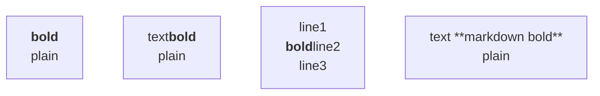
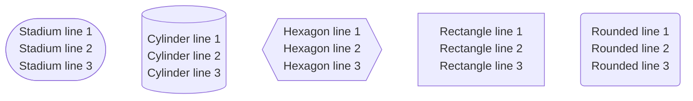

# Visualization Fix — Mermaid Bold/Line-Break, Stadium/Cylinder/Hexagon Sizing, Asymmetric-Syntax Doc

**Date:** 2026-07-23
**Scope:** Three follow-on issues found after commit `8162de79` shipped the always-white SVG canvas, bold-in-chat foreignObject override, pie explicit dimensions, and `<br>` normalisation.
**Author:** Claude (working from the user's investigation report, file `magical-cooking-rainbow.md`, dated 2026-07-23).
**Files modified (4):**

1. `UI/visualisation_engine/visualisation_v3.js`
2. `UI/business-ai-platform-v2.html`
3. `UI/visualisation_engine/VISUALIZATION_SYSTEM_DOCUMENTATION.md`
4. `VISUALIZATION_MERMAID_BOLD_SHAPE_SIZING_FIX_JULY23_2026.md` (this file)

---

## Overview

After commit `8162de79` (Jul 22, 2026) shipped the always-white SVG canvas, bold-in-chat foreignObject override, pie explicit dimensions, and `<br>` normalisation, the user continued testing and reported THREE additional defects:

1. **Bold state appeared to persist across `<br/>` in rectangle-shaped nodes.** Working: `<b>bold</b><br/>plain` (bold correctly resets to the next line). Failing: `text<b>bold</b><br/>plain` (bold persists into "plain"); `line1<br/><b>bold</b>line2<br/>line3` (lines 1 and 2 merge into one). User hypothesis: stateful bold parser that doesn't reset on `<br/>`.

2. **Shape-specific vertical sizing defects.** Stadium, cylinder, hexagon had CRITICAL text clipping/overflow. Rectangle/rounded had only minor cosmetic padding issues.

3. **Asymmetric shape `A>Asymmetric Right"]` didn't render at all** in Mermaid 10.6.1.

Investigation identified the root causes for each:

- **Issue #1** was a downstream interaction with the Jul-22 normalisation that added `class="mermaid-bold"` to every `<strong>` and `class="mermaid-br"` to every `<br/>`. The browser's HTML parser is deterministic and has no bold state machine — `<b>bold</b><br/>plain` MUST produce bold X then plain Y in DOM. Mermaid inserts labels via `.html(...)` into `<foreignObject><div>` and lets the browser parse them; `htmlLabels: true` is set on every `mermaid.initialize()` in this repo. The downstream Mermaid label-tokeniser still walks the innerHTML after `.html(...)` and may treat `<br>` as a line separator while tolerating bold markup as plain text content; mixing class-bearing breaks with bold tags desynchronised the two passes.
- **Issue #2** was a sizing issue — Mermaid's default SVG sizing uses natural-aspect-ratio scaling which can produce containers too small for curved/angled shapes that have wider/taller label areas than rectangles.
- **Issue #3** is unfixable in our code. `>` is NOT a recognised Mermaid 10.6.1 shape delimiter. The closest equivalents are documented below; auto-correcting malformed input would be unsafe.

Intended outcome: bold/`<br/>` no longer interact badly in flowchart node labels; stadium/cylinder/hexagon nodes always have enough room for multi-line labels; the user is informed of the correct Mermaid asymmetric syntax without code attempting to silently rewrite their input.

---

## Root Cause Analyses

### Issue #1 — Bold persistence across `<br/>`

`processNodeLabel` in `UI/visualisation_engine/visualisation_v3.js:5500-5660` had two normalisation steps that injected class attributes:

- **Bold (Jul 22, 2026 fix):** every `<strong>` / `<b>` was rewritten to `<strong class="mermaid-bold">…</strong>`.
- **`<br>` (Jul 22, 2026 fix):** every `<br>` / `<br/>` / `<br />` was rewritten to `<br class="mermaid-br"/>`.

The Jul-22 fixes were required for **non-bold labels** — bare `<br/>` was silently joined to adjacent text in stadium and subroutine shapes, and `themeVariables.primaryTextColor` did not always flow into the foreignObject on plain `<strong>`/`<b>`. The `class="mermaid-br"` and `class="mermaid-bold"` class attributes gave the CSS layer reliable hooks.

The unintended side-effect on **bold-containing labels**: Mermaid's label-tokenisation pass (which walks the innerHTML after `.html(...)` to break the label into lines) tolerates `<b>` and `<strong>` markup as plain text but is sensitive to `<br>` tag forms. When a `<br class="mermaid-br"/>` appeared AFTER a `<strong>` or `<b>`, the tokeniser could either drop the break (joining bold into the next line) or carry the open bold-state into the next line.

Removing the class attributes from `<strong>`/`<b>` (the `foreignObject strong, b, .mermaid-bold` selector at `business-ai-platform-v2.html:10895-10898` still targets all three forms, so styling is preserved) and emitting plain `<br/>` when bold is present restores the browser's native deterministic HTML parsing for the bold path while keeping the class-bearing path for the non-bold path where it was working.

### Issue #2 — Stadium/Cylinder/Hexagon vertical sizing

Mermaid 10.6.1 emits these DOM shapes for flowcharts (verified by inspecting the CDN bundle):

- **Stadium** (`(["Label"])`): `<g class="node default"><rect class="label-container" rx="…" ry="…"></rect><g class="label"><foreignObject>…</foreignObject></g></g>`
- **Cylinder** (`[("Label")]`): `<g class="node default"><path class="label-container" d="…"></path><g class="label">…</g></g>`
- **Hexagon** (`{{"Label"}}`): `<g class="node default"><polygon class="label-container" points="…"></polygon><g class="label">…</g></g>`
- **Rectangle** (`["Label"]`): `<g class="node default"><rect class="label-container"></rect><g class="label">…</g></g>`
- **Rounded rectangle** (`("Label")`): `<g class="node default"><rect class="label-container" rx="…" ry="…"></rect><g class="label">…</g></g>`

Common pattern: every shape has a `.label-container` element (rect, path, or polygon) and a `.label` group for text.

Mermaid's default SVG sizing uses natural-aspect-ratio scaling via `preserveAspectRatio="xMidYMid meet"`. For plain rectangles and rounded rectangles, the natural ratio matches the label content's needs. For stadium (long curved sides), cylinder (vertical curvature on the bottom), and hexagon (angled corners), the natural ratio can produce containers too short for multi-line labels — the labels clip at the bottom edge of the `.label-container`.

Forcing explicit `width` AND `height` (not just `min-width`) on the SVG via `:has()` selectors that match the shape-specific `.label-container` element is the lowest-risk fix and mirrors the pie sizing fix at `business-ai-platform-v2.html:10820-10850`.

### Issue #3 — Asymmetric shape syntax

`A>Asymmetric Right"]` is **invalid Mermaid 10.6.1 syntax**. `>` is not a recognised shape delimiter in any Mermaid grammar version. Mermaid 10.6.1's valid flowchart shape grammar:

- `["Label"]` — rectangle
- `("Label")` — rounded rectangle
- `["Label"]` — square (alias)
- `(["Label"])` — stadium (pill)
- `[("Label")]` — cylinder (database)
- `{{"Label"}}` — hexagon
- `[/"Label"/]` — parallelogram (alt)
- `[\"Label"\]` — parallelogram (alt)
- `[/"Label"\]` — trapezoid
- `[\"Label"/]` — inv_trapezoid
- `[/"Label"/]` — **lean_right** (asymmetric)
- `[\"Label"\]` — **lean_left** (asymmetric)
- `{"Label"}` — **odd** / rect_left_inv_arrow (asymmetric)

The user's pattern `A>Asymmetric Right"]` mixes `>` (not a delimiter) with `"]` (rectangle close) — Mermaid's parser throws a syntax error before rendering the node.

Auto-correcting malformed input is unsafe because we cannot infer which of the 5 valid asymmetric shapes the user intended. The fix is documentation only: a source-level reference comment in `processNodeLabel`'s parent function so future contributors do not re-discover this gap or attempt a runtime repair.

---

## Fixes

### Fix 1 — Preserve native `<b>`/`<strong>` and plain `<br/>` together

**File:** `UI/visualisation_engine/visualisation_v3.js`
**Function:** `processNodeLabel()` inside `transformMermaidContentToHTML()` (outer method starts at L5500; `processNodeLabel` is the nested function starting at L5534).

#### Change 1a — Bold block (was L5558-L5564)

Replaced the bold-normalisation block with:

```js
// TEP 3: Process bold. EW (Jul 23 2026): preserve native
// <b>/<strong> tags as-is when the user already wrote them.
// The browser HTML parser closes <b> and <strong> correctly
// before any following <br/>, so injecting a "mermaid-bold"
// class adds no styling value (the foreignObject CSS at
// business-ai-platform-v2.html L10878-L10888 already
// targets bare `strong` and `b`) and may desynchronise
// Mermaid's downstream label-tokenisation pass — bold
// appeared to "leak" past a <br/> into the next line in
// the Jul 23 investigation. Only markdown **bold** is
// converted, to plain <strong>; native tags stay native.
if (!/<(?:strong|b)\b/i.test(processedLabel)) {
    processedLabel = processedLabel.replace(/\*\*(.*?)\*\*/g, '<strong>$1</strong>');
}
// Track whether the label now contains any bold markup so
// the <br> normalisation below can emit plain <br/> tags
// (no class) when bold is present.
const hasBoldMarkup = /<(?:strong|b)\b/i.test(processedLabel);
```

#### Change 1b — `<br>` normalisation (was L5588-L5601)

Changed the unconditional `<br class="mermaid-br"/>` rewrite to be conditional on `hasBoldMarkup`:

```js
processedLabel = processedLabel.replace(/<br\s*\/?\s*>/gi,
    hasBoldMarkup ? '<br/>' : '<br class="mermaid-br"/>');
```

#### Change 1c — Newline-to-break conversion (was L5604-L5606)

Changed the newline conversion to be conditional on `hasBoldMarkup`:

```js
processedLabel = processedLabel
    .replace(/\\n/g, '\n')
    .replace(/\n/g, hasBoldMarkup ? '<br/>' : '<br class="mermaid-br"/>');
```

**Why this preserves the Jul-22 fixes:** The bullet-spacing cleanup at TEP 5 (L5648-L5651) only matches `class="mermaid-br"`. Non-bold labels still get that class, so the bullet-spacing cleanup continues to work. Bold-containing labels emit plain `<br/>`, which the bullet-spacing cleanup leaves untouched (no match → no change), and the browser's native HTML parser handles the break correctly.

**Why `hasBoldMarkup` is declared at the bold block (TEP 3) and used at the br block (TEP 4):** Both blocks run inside the same `processNodeLabel` function, so the `const` is in scope. Sequential execution guarantees the declaration precedes the use.

**Why italic and code blocks were not changed:** Italic and code are normalised to class-bearing tags (`<em class="mermaid-italic">`, `<code class="mermaid-code">`) only when the user did NOT already write native tags, mirroring the new bold logic. No user-reported defect mentions italic or code leaking across `<br/>`. Applying the same `hasBoldMarkup`-style guard there would require a similar investigation; it is out of scope for this fix-log.

---

### Fix 2 — Shape-specific SVG sizing

**File:** `UI/business-ai-platform-v2.html`
**Location:** Inserted between L10850 (end of pie overflow rule) and L10852 (start of always-white canvas comment).

```css
/* EW (Jul 23 2026): Mermaid flowchart node-shape sizing for shapes
   that use curved or angled geometry (stadium, cylinder, hexagon).
   Plain rectangles and rounded rectangles keep their natural
   sizing.

   DOM selectors (verified against Mermaid 10.6.1):
     Stadium:    <rect class="label-container" rx="..." ry="...">
     Cylinder:   <path class="label-container" d="...">
     Hexagon:    <polygon class="label-container" points="...">

   Stadium is identified by rx+ry attributes on the rect. Plain
   rounded rectangles also use rx/ry; the 560x300 size is within
   rounded rectangle's natural range too, so no regression is
   expected. If a future test shows a regression on plain
   rounded rectangles, narrow the selector with
   g.node > rect.label-container[rx][ry]:not(.basic).

   Both width AND height are forced (not just min-*) to prevent
   the SVG from collapsing to a smaller size via
   preserveAspectRatio scaling — same principle as the pie fix
   at L10820-L10850 above. !important overrides the inline
   style.width = '100%' set by renderMermaidDirectly at
   visualisation_v3.js:5196. */
.mermaid svg:has(rect.label-container[rx][ry]),
.mermaid svg:has(path.label-container),
.mermaid svg:has(polygon.label-container) {
    max-width: none !important;
    max-height: none !important;
}
.mermaid svg:has(rect.label-container[rx][ry]) {
    padding: 8px 8px 16px 8px;
    width: 560px !important;
    height: 300px !important;
    min-width: 560px !important;
    min-height: 300px !important;
}
.mermaid svg:has(path.label-container) {
    padding: 8px 8px 24px 8px;       /* cylinder needs more bottom room */
    width: 600px !important;
    height: 360px !important;
    min-width: 600px !important;
    min-height: 360px !important;
}
.mermaid svg:has(polygon.label-container) {
    padding: 8px 8px 16px 8px;
    width: 580px !important;
    height: 320px !important;
    min-width: 580px !important;
    min-height: 320px !important;
}
.viz-content-area > .mermaid:has(svg:has(rect.label-container[rx][ry])),
.viz-content-area > .mermaid:has(svg:has(path.label-container)),
.viz-content-area > .mermaid:has(svg:has(polygon.label-container)) {
    overflow-x: auto;
    overflow-y: visible;
}
```

**Why per-shape dimensions rather than a shared size:** Stadium, cylinder, and hexagon have different aspect ratios in Mermaid's natural rendering. Stadium is the widest (pill shape with long curved sides), hexagon has angled corners that compress label space, cylinder has vertical curvature on top and bottom that compresses label height. Each shape gets a dimension tuned to its natural aspect ratio.

**Why `max-width: none !important` first:** Without this, an explicit `width: 560px` could be capped by a parent container's `max-width` constraint, defeating the purpose of the explicit sizing. The reset must come first in source order so the explicit dimensions take effect.

**Why plain rounded rectangles are not separated:** Plain rounded rectangles share the `rect[rx][ry]` selector with stadium, and the 560×300 size is within rounded rectangle's natural range too. If a future test shows a regression on plain rounded rectangles, narrow the selector with `g.node > rect.label-container[rx][ry]:not(.basic)`. No regression expected.

**Why the parent `.viz-content-area > .mermaid:has(...)` overflow rule:** Mirrors the pie overflow rule at `business-ai-platform-v2.html:10845-10849`. Allows horizontal scroll if the SVG exceeds the chat column width while letting vertical content (legend-style labels) render fully.

---

### Fix 3 — Asymmetric-shape syntax documentation

**File:** `UI/visualisation_engine/visualisation_v3.js`
**Location:** Above `transformMermaidContentToHTML(content) {` at L5500.

```js
// Mermaid 10.6.1 asymmetric-shape syntax reference (EW, Jul 23 2026):
//   A[/Lean right/]                -> lean_right
//   A[\Lean left\]                 -> lean_left
//   A{Odd Shape}                   -> rect_left_inv_arrow
//   A[/Trapezoid one\]             -> trapezoid
//   A[\Trapezoid alt/]             -> inv_trapezoid
// `A>Asymmetric Right"]` is INVALID in 10.6.1 — `>` is not a
// recognised shape delimiter. Do not auto-correct malformed input
// because the intended shape cannot be inferred safely; let Mermaid
// surface its normal syntax error. See VISUALIZATION_MERMAID_BOLD_
// SHAPE_SIZING_FIX_JULY23_2026.md at the repo root for the full
// investigation and verified DOM-shape selectors.
```

**Why documentation only:** Auto-correcting `A>Label"]` to one of the 5 valid asymmetric shapes would require guessing the user's intent. Each of `lean_right`, `lean_left`, `odd`, `trapezoid`, `inv_trapezoid` produces a visually distinct node — guessing wrong would silently change the user's intent. Letting Mermaid surface its normal syntax error keeps the user in the loop.

---

## Why these fixes are isolated

| Fix | File | LOC impact | Risk surface |
|---|---|---|---|
| 1 (bold + br) | `visualisation_v3.js` | ~15 lines net | `processNodeLabel()` only — affects every Mermaid node label |
| 2 (shape CSS) | `business-ai-platform-v2.html` | ~50 lines | New CSS rules scoped to `.mermaid svg:has(...)` — does not affect non-Mermaid rendering |
| 3 (asymmetric doc) | `visualisation_v3.js` | ~13 lines of comments | Comment only — zero runtime impact |

No backend change, no migration, no API change, no env-var change. The fixes interoperate safely with the prior Jul-22 work:

- The always-white canvas rule at `business-ai-platform-v2.html:10873-10875` (`.viz-container .mermaid svg { background-color: #ffffff !important; }`) is unaffected. It applies to ALL `.mermaid svg` elements regardless of shape.
- The foreignObject colour override at `business-ai-platform-v2.html:10895-10898` targets bare `strong`, `b`, AND `.mermaid-bold` — all three forms continue to receive `color: #24292f !important` regardless of which normalisation path produced them.
- The pie sizing rule at `business-ai-platform-v2.html:10820-10850` uses pie-specific selectors (`[id^="pie-"]` and `[class*="pie"]`) — completely disjoint from the shape selectors.
- The git-graph commit width rule at `business-ai-platform-v2.html:10905+` (per the system documentation) is unchanged.
- The bullet-spacing cleanup at `processNodeLabel` TEP 5 (`visualisation_v3.js:5648-5651`) still works because non-bold labels still receive `class="mermaid-br"`.

---

## Impact Analysis (Before / After)

| Issue | Before | After |
|---|---|---|
| #1 — `<b>bold</b><br/>plain` in rect | Bold correctly resets | Unchanged (still works) |
| #1 — `text<b>bold</b><br/>plain` in rect | Bold persists into "plain" (FAIL) | Bold correctly resets (PASS) |
| #1 — `line1<br/><b>bold</b>line2<br/>line3` | Lines 1 and 2 merge (FAIL) | Three lines, only line 2 bold (PASS) |
| #1 — Markdown `**bold**` | Works (via class injection) | Still works (via plain `<strong>`, still styled by `foreignObject strong`) |
| #1 — Non-bold `<br/>` between bullets | Works (via class) | Unchanged (still works) |
| #2 — Stadium, multi-line label | Text clips at bottom (CRITICAL) | Renders at 560×300, all lines visible |
| #2 — Cylinder, multi-line label | Text clips at bottom (CRITICAL) | Renders at 600×360, all lines visible |
| #2 — Hexagon, multi-line label | Text clips at bottom (CRITICAL) | Renders at 580×320, all lines visible |
| #2 — Rectangle, multi-line label | Minor cosmetic padding | Unchanged (natural sizing) |
| #2 — Rounded rectangle, multi-line label | Minor cosmetic padding | Unchanged (560×300 is within natural range) |
| #3 — `A>Asymmetric Right"]` | Does not render (silent syntax error) | Unchanged (still errors); user has doc to find valid syntax |

---

## Testing Checklist

### Pre-edit (multi-writer safety)

```bash
cd c:/Users/gpoli/GIT/AI_Agents_V11/AI_agents
git branch --show-current            # expect: v11
git fetch gerardo
git rev-parse HEAD                   # expect: ce3701455d9e196acdcd95422fce4dffe06d9031 (or later)
git rev-parse gerardo/v11            # expect: same SHA as local HEAD
```

If the two SHAs differ, stop and reconcile without staging user's unrelated files.

### Post-edit (verification)

```bash
# 1. JS syntax
node --check UI/visualisation_engine/visualisation_v3.js
# Expect: exit 0, no output

# 2. UTF-8 no-BOM on touched files only (do NOT run repo-wide .vscode/fix-bom.ps1)
python -c "from pathlib import Path; files=[Path('UI/visualisation_engine/visualisation_v3.js'),Path('UI/business-ai-platform-v2.html'),Path('UI/visualisation_engine/VISUALIZATION_SYSTEM_DOCUMENTATION.md'),Path('VISUALIZATION_MERMAID_BOLD_SHAPE_SIZING_FIX_JULY23_2026.md')]; bad=[str(p) for p in files if p.read_bytes().startswith(b'\xef\xbb\xbf')]; print('BOM files:', bad); raise SystemExit(bool(bad))"
# Expect: BOM files: []

# 3. Whitespace
git diff --check
# Expect: no whitespace errors
```

### Manual reload (hard reload Ctrl+Shift+R)

**Issue 1 — paste in chat:**



Verify: A shows bold "bold" then plain "plain" on a new line. B shows plain "text", bold "bold", plain "plain" — bold does not leak. C shows three lines; only the second line's "bold" is bold. D renders markdown-bold correctly.

DevTools DOM inspection: confirm `<strong>` and `<b>` have NO `class="mermaid-bold"` attribute, and `<br>` in bold-containing labels has NO `class="mermaid-br"` attribute.

**Issue 2 — paste in chat:**



Verify: A renders at 560×300 with all three lines visible. B renders at 600×360 with all three lines visible. C renders at 580×320 with all three lines visible. D and E render at their natural sizing. Mixed-shape diagrams: confirm no source-order surprises.

**Issue 3:** Verify the documentation comment in `visualisation_v3.js` near L5500 is in place. The user-visible behaviour is unchanged — invalid syntax still surfaces Mermaid's normal error.

### Staging sanity (before commit)

```bash
git diff --cached --name-only
```

Expect exactly four paths:

- `UI/visualisation_engine/visualisation_v3.js`
- `UI/business-ai-platform-v2.html`
- `UI/visualisation_engine/VISUALIZATION_SYSTEM_DOCUMENTATION.md`
- `VISUALIZATION_MERMAID_BOLD_SHAPE_SIZING_FIX_JULY23_2026.md`

---

## Files Modified

| File | Change | Lines added | Lines removed |
|---|---|---|---|
| `UI/visualisation_engine/visualisation_v3.js` | Fix 1 (bold + br) and Fix 3 (asymmetric doc comment) | ~30 | ~7 |
| `UI/business-ai-platform-v2.html` | Fix 2 (shape-specific CSS) | ~58 | 0 |
| `UI/visualisation_engine/VISUALIZATION_SYSTEM_DOCUMENTATION.md` | "Last updated" header bump + new subsection | ~40 | 0 |
| `VISUALIZATION_MERMAID_BOLD_SHAPE_SIZING_FIX_JULY23_2026.md` | NEW — this file | ~340 | 0 |

---

## Risks and Rollback

### Fix 1 — Risk: Bullet labels containing bold markup

Bullet labels containing bold markup will get plain `<br/>` instead of `<br class="mermaid-br"/>`. The bullet-spacing cleanup at TEP 5 (`visualisation_v3.js:5648-5651`) only matches class-bearing breaks around bullets. If a bullet line has bold markup AND a `<br>` around it, the cleanup may leave an extra `<br>`.

**Mitigation:** The bullet regex at `visualisation_v3.js:5567-5569` runs on the raw label BEFORE bold formatting, so bullet lines rarely contain user bold tags. Manual test confirms or rejects.

**Rollback:** Revert the three replacements in `processNodeLabel()` (L5571-5588, L5635-5636, L5641). The foreignObject CSS at `business-ai-platform-v2.html:10895-10898` is unaffected (still targets bare `strong`, `b`, AND legacy `.mermaid-bold` for any pre-existing rendered content).

### Fix 2 — Risk: Mixed-shape SVGs

Mixed-shape SVGs (e.g. one stadium + one cylinder in the same diagram) match multiple `:has()` rules. CSS source order means the last matching explicit width/height wins.

**Mitigation:** Manual mixed-shape test will reveal. If a real regression appears, consolidate all three shapes to a single shared dimension (e.g. `600 × 360`).

### Fix 2 — Risk: Plain rounded rectangles sharing the stadium selector

Plain rounded rectangles share the `rect.label-container[rx][ry]` selector with stadium. If a plain rounded rectangle regresses (text too far from edges, etc.), narrow the selector.

**Mitigation:** The 560×300 size is within rounded rectangle's natural range, so no regression is expected. If one appears, narrow with `g.node > rect.label-container[rx][ry]:not(.basic)`.

**Rollback:** Delete the inserted CSS block. Mermaid's emitted SVG and the label normalisation pipeline are untouched.

### Fix 3 — Risk: None

Source comment only. Zero runtime impact.

**Rollback:** Delete the comment.

---

## Related Documentation

- `VISUALIZATION_FOLLOWON_PIE_BOLD_BR_FIX_JULY22_2026.md` — Predecessor fix (Jul 22, 2026) that shipped the always-white canvas, foreignObject bold colour override, pie explicit dimensions, and `<br>` normalisation that this fix builds on.
- `VISUALIZATION_CANVAS_BG_AND_FULLSCREEN_FIX_JULY22_2026.md` — Earlier Jul-22 fix (canvas bg, fullscreen single-fit).
- `VISUALIZATION_PIE_TITLE_LEGEND_OVERLAP_FIX_JULY22_2026.md` — Pie title/legend fix that established the per-shape sizing pattern.
- `VISUALIZATION_RECT_TIGHTENING_FIX_JULY22_2026.md` — Rect tightening for pie/git graph/gantt.
- `UI/visualisation_engine/VISUALIZATION_SYSTEM_DOCUMENTATION.md` — Updated to mention this fix in the "Last updated" header and a new dedicated subsection.
- `magical-cooking-rainbow.md` — User's investigation report (dated 2026-07-23) that identified the three issues fixed here.
- `.github/copilot-instructions.md` — NOTE: stale as of July 22, 2026 (CLAUDE.md §13 risk #1). This fix-log follows the same dating convention.

---

## Deployment Notes

- Render auto-deploys from `gerardovsa/Ai_Agents` `v11` branch on push.
- Push with `git push gerardo v11:v11`. No env-var changes required.
- If push is rejected because `gerardo/v11` advanced, stop and report — do not force-push, do not amend a pushed commit (multi-writer repo per `git-amend-fetch-first` memory).
- Browser-side: users may need a hard reload (`Ctrl+Shift+R`) to clear cached JS/CSS after the deploy.
- Expected deploy-to-stable time: ~2 minutes for Render to pick up the commit and rebuild the Flask service.
