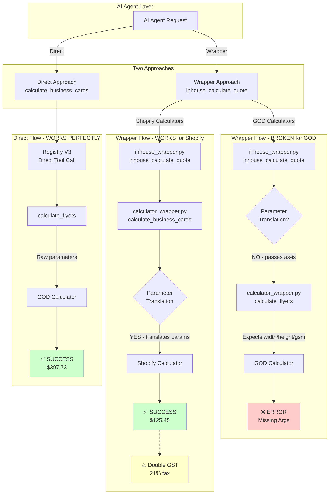
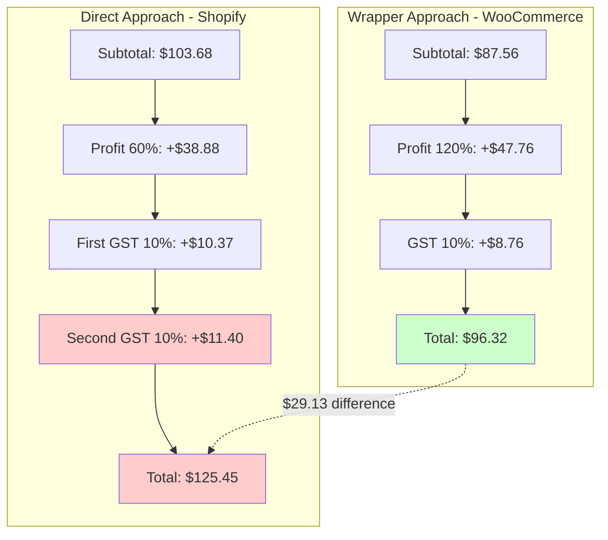
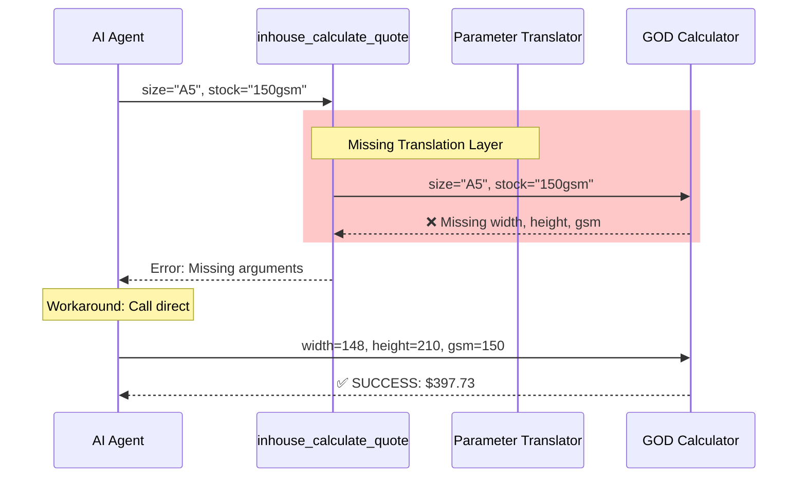
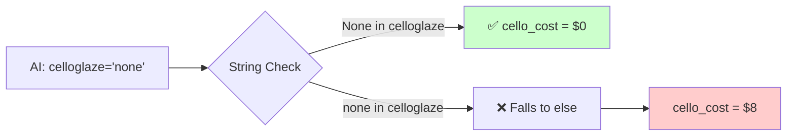
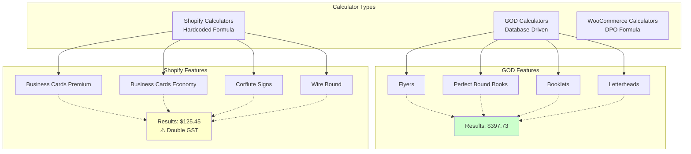
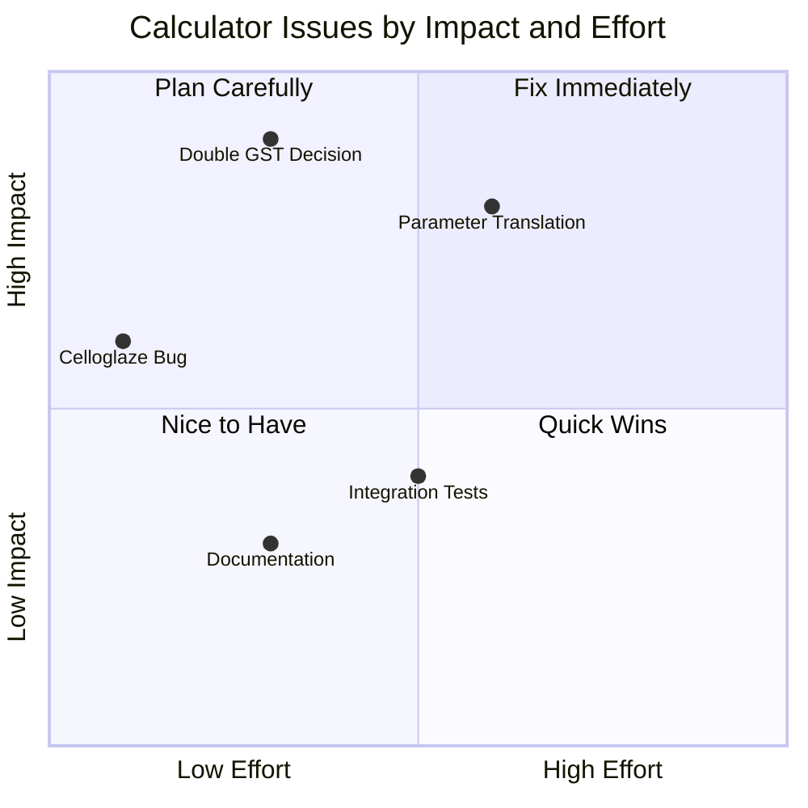
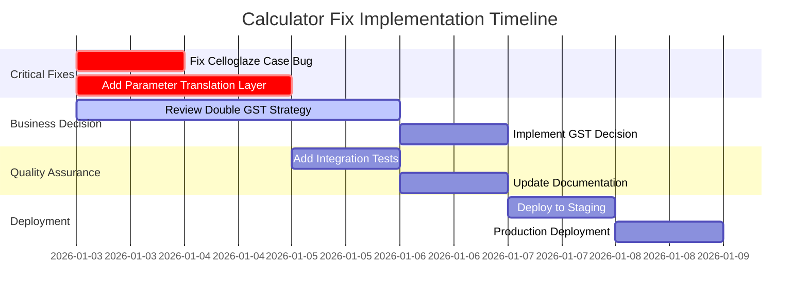

## Key Findings Visualization

### Business Cards Pricing Breakdown

### Parameter Translation Issue

### Celloglaze Bug Flow

## Calculator System Architecture

## Issues Priority Matrix

## Recommended Fix Sequence

